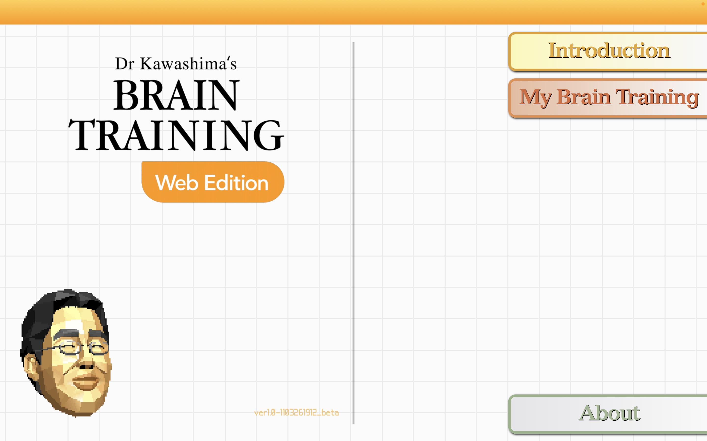
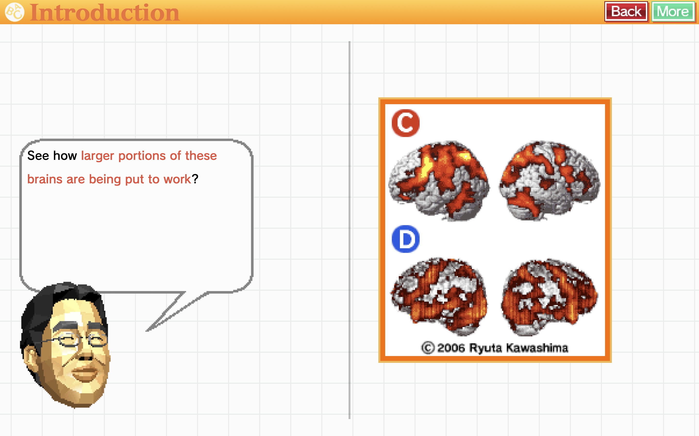
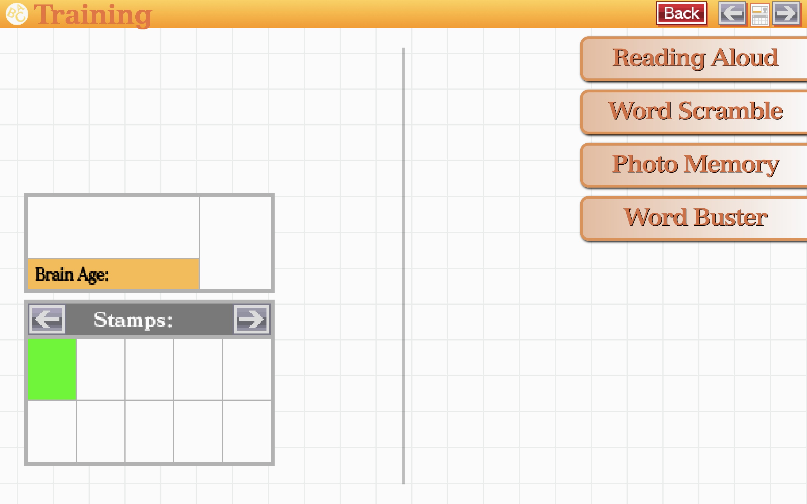
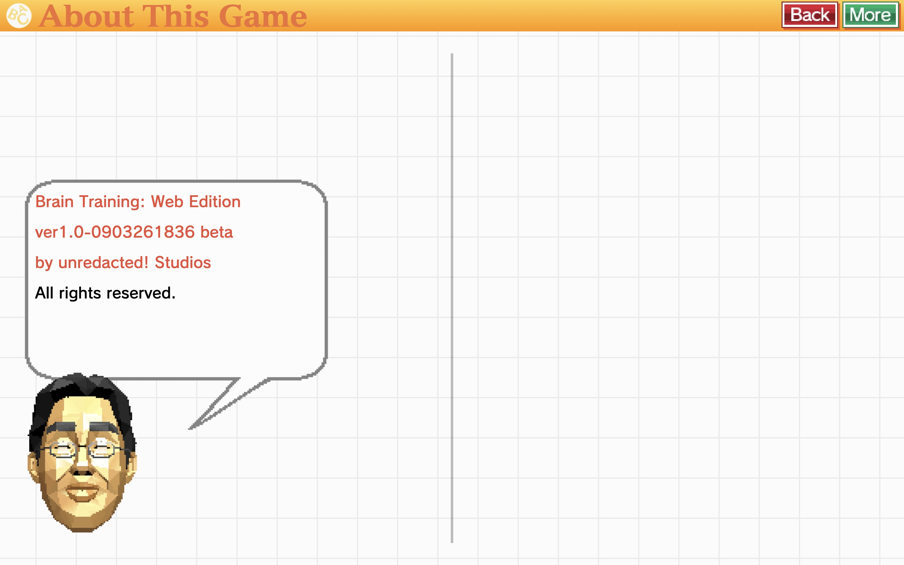
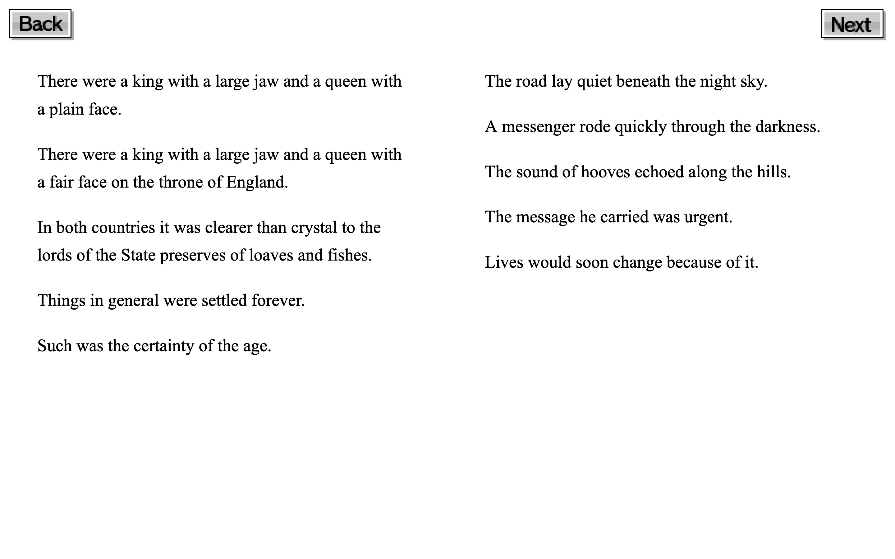
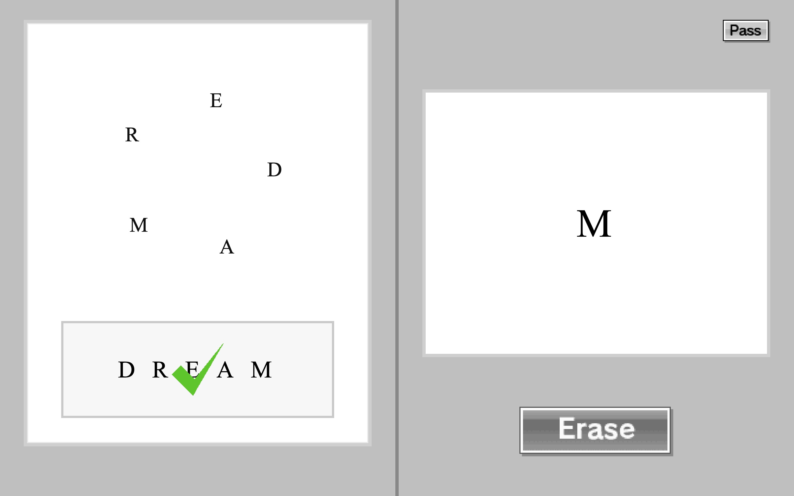
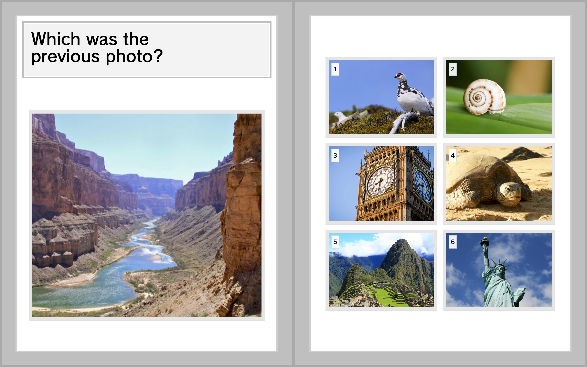
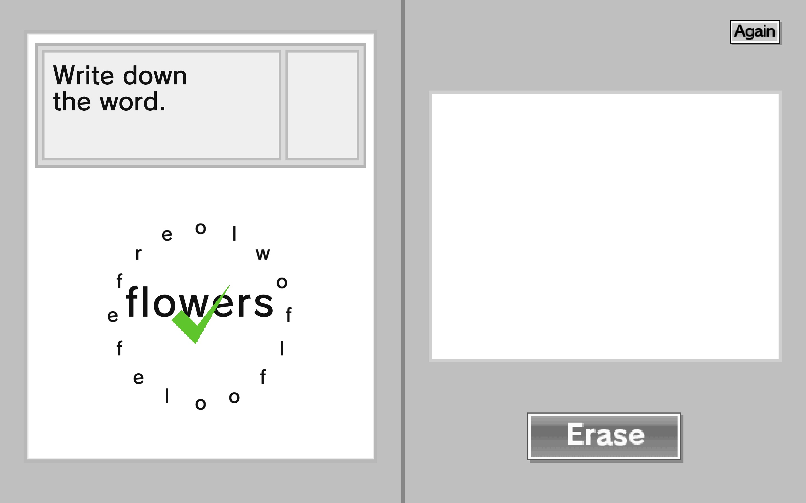

<div align="center">
  <a href="https://github.com/unredactedStudios/BrainAge/">
    
  </a>

<p></p>

  <p align="center">
    A browser-based adaptation inspired by the Brain Age series for Nintendo DS, recreating the original game's feel using modern web technologies and playable directly in the browser.
    
<p></p>
    © 2026 unredactedStudios
    <br>
    © 2005–2009 Nintendo. All rights reserved.
    <br />
    <br />
  </p>
</div>

<br><br>
## About

**Brain Training: Web Edition** is a fan-made web adaptation of the Nintendo DS Brain Age series.
The goal of this project is to recreate the feel of the original daily training exercises while making them playable on modern devices without requiring special hardware.

The project focuses on:

* Simple, fast exercises
* Minimal UI inspired by the DS aesthetic
* Browser compatibility
* Lightweight assets and instant loading

<br><br>
## Activities

* **Reading Aloud**
  Read text extracted from public domain books
  
* **Word Scramble**
  Unscramble rotating letters to form the word

* **Word Buster**
  Quickly type the word shown after it's shown briefly

* **Photo Memory**
  Memorise the image and recall it after a delay

More exercises may be added in future versions.

<br><br>

## Tech Stack

* **HTML5**
* **CSS3**
* **Vanilla JavaScript**
* Custom assets and UI styling inspired by the Nintendo DS interface

No frameworks are required to run the project.

<br><br>

## Launching the game

[Download](https://github.com/unredactedStudios/BrainAge/releases) or clone the repository:

```bash
git clone https://github.com/yourusername/brain-training-web-edition.git
```

Open the project folder and open:

```
index.html
```

<br><br>

## Screenshots

<table>
<tr>
<td align="center">
<br>
Home Screen
</td>

<td align="center">
<br>
Introduction
</td>
</tr>

<tr>
<td align="center">
<br>
Training Menu
</td>

<td align="center">
<br>
About This Game
</td>
</tr>

<tr>
<td align="center">
<br>
Reading Aloud Gameplay
</td>

<td align="center">
<br>
Word Scramble Gameplay
</td>
</tr>

<tr>
<td align="center">
<br>
Photo Memory Gameplay
</td>

<td align="center">
<br>
Word Buster Gameplay
</td>
</tr>
</table>

<br><br>

## Disclaimer

This is an **unofficial fan project** created for educational and entertainment purposes.

This project is **not affiliated with, endorsed by, or sponsored by Nintendo**.

Original game, characters, names, and assets from:

**Dr Kawashima’s Brain Training / Brain Age**
© 2005–2009 Nintendo. All rights reserved.

<br><br>

## License

Code for this project is released under the **MIT License**.

Original Nintendo intellectual property remains the property of Nintendo.
